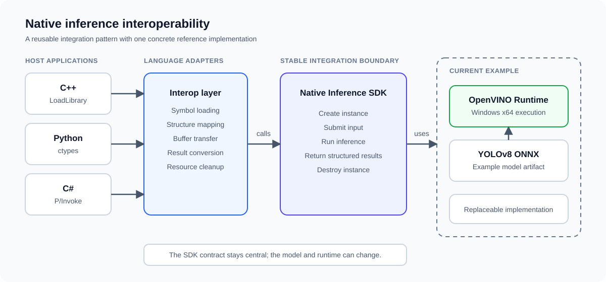
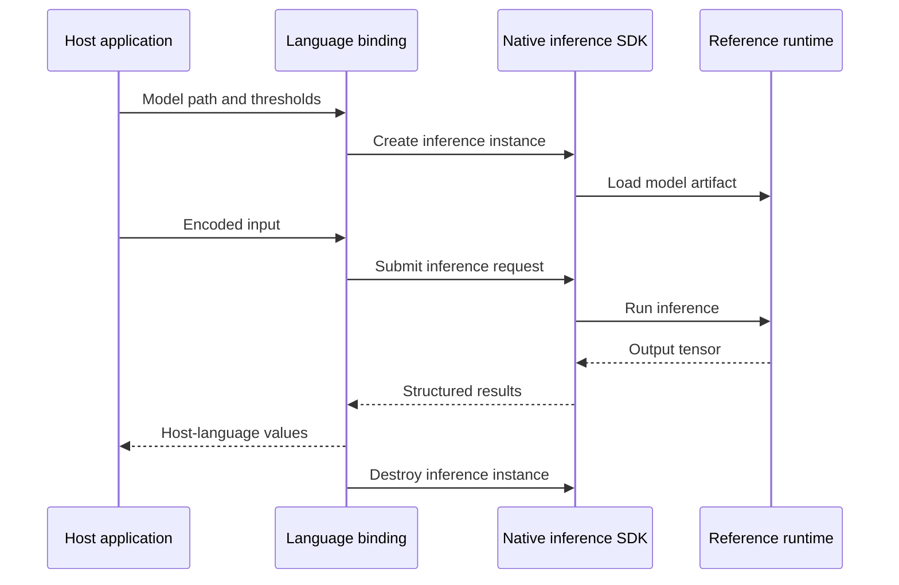

# ByteWhisperer

ByteWhisperer is a cross-language reference for integrating native inference SDKs into C++, Python, and C# applications. It focuses on the interoperability layer around inference rather than a specific model family or training framework.

The current reference implementation uses YOLOv8, ONNX, and OpenVINO behind a Windows x64 DLL. They provide a concrete example for loading a native library, mapping data structures, passing encoded input, retrieving results, and releasing unmanaged resources. Model training is outside the repository's scope.



## Why this repository exists

Packaging an inference runtime is only one part of deployment. A desktop or industrial application still needs a stable way to load the SDK, pass data across language boundaries, and turn native outputs into structures the host language can safely use.

ByteWhisperer keeps that integration path visible. The three examples use different interop mechanisms, but they follow the same lifecycle:

1. Define structures compatible with the native interface.
2. Load the SDK library and resolve its exported functions.
3. Create an inference instance from a runtime configuration.
4. Pass encoded input through the language boundary.
5. Copy structured inference results back to the caller.
6. Release native objects, buffers, and the loaded library.

## Language bindings

| Language | Interop mechanism | What the example demonstrates |
| --- | --- | --- |
| C++ | `LoadLibrary` and `GetProcAddress` | Explicit symbol loading, native structures, OpenCV visualization, and DLL lifetime management |
| Python | `ctypes` | Structure mapping, function signatures, byte-buffer transfer, and result decoding |
| C# | P/Invoke and marshaling | Managed/unmanaged structure mapping, buffer allocation, result copying, and deterministic cleanup |

The current YOLOv8 example exposes the same lifecycle to all three languages:

```text
CreateYOLOV8 -> DetectYOLOV8 -> GetDetectionsYOLOV8 -> DestroyYOLOV8
```

## Current reference implementation

| Layer | Current implementation |
| --- | --- |
| Operating system | Windows x64 |
| Model format | YOLOv8 ONNX |
| Inference runtime | OpenVINO 2023.1.0 |
| Native SDK | `YOLOv8_SDK.dll` with a C-style exported interface |
| C++ example | C++14, CMake 3.15+, Conan, OpenCV 4.8.1 |
| Python example | Python 3, `ctypes`, Pillow |
| C# example | .NET Framework 4.7.2, x64 |

The repository contains the runtime DLLs and sample ONNX model used by this implementation. The integration pattern can be adapted to other native inference SDKs, though their structures, ownership rules, and error contracts will differ. ByteWhisperer is not a cross-platform package, a general-purpose model server, or a training framework.

## Quick start

### Repository layout

```text
ByteWhisperer/
├── C++/          # LoadLibrary-based native integration example
├── Python/       # ctypes binding example
├── CSharp/       # .NET Framework P/Invoke example
├── DLL/          # Native SDK and runtime dependencies
├── Models/       # ONNX model used by the examples
├── TestImages/   # Public test input
└── docs/         # Architecture and documentation assets
```

### C++

The C++ example uses Conan to resolve OpenCV and OpenVINO development dependencies, then copies the required runtime DLLs next to the executable.

```powershell
cd C++
mkdir build
cd build
conan install .. --install-folder=.
cmake .. -DCMAKE_BUILD_TYPE=Release
cmake --build . --config Release
```

See [`C++/README.md`](C++/README.md) for the expected environment and runtime layout.

### Python

```powershell
python -m venv .venv
.venv\Scripts\activate
pip install -r Python\requirements.txt
python Python\example.py
```

Optional model and image paths can be supplied explicitly:

```powershell
python Python\example.py Models\yolov8n.onnx TestImages\bus.jpg
```

### C#

Open `CSharp/CSharp.sln` in Visual Studio, select **Release** and **x64**, restore NuGet packages, and build the solution. The example uses repository-relative defaults and also accepts optional model and image paths:

```powershell
CSharp.exe Models\yolov8n.onnx TestImages\bus.jpg
```

The native SDK and its dependencies must be available beside the executable or on the Windows DLL search path.

## Current example interface

The included SDK contract consists of two structures and four exported functions. `Config` carries thresholds, input dimensions, and the model path. `Detection` returns a class ID, confidence value, and bounding box. These YOLOv8-specific names belong to the current example rather than the general ByteWhisperer concept.

```cpp
extern "C" {
    YOLOV8_API void* CreateYOLOV8(Config config);
    YOLOV8_API void DestroyYOLOV8(void* yolov8);
    YOLOV8_API void DetectYOLOV8(
        void* yolov8,
        unsigned char* image_data,
        int data_length,
        int width,
        int height
    );
    YOLOV8_API void GetDetectionsYOLOV8(
        void* yolov8,
        Detection* detections,
        int* num_detections
    );
}
```

This narrow API keeps the host-language examples comparable. It also exposes the part that requires the most care: structure layout, calling convention, buffer capacity, path encoding, and ownership must remain consistent with the compiled SDK.

## Integration flow



## Current boundaries

- The provided SDK and runtime binaries target Windows x64.
- The repository demonstrates single-image object detection, not streaming, batching, or concurrent inference.
- The native SDK implementation is distributed as a compiled DLL; this repository focuses on consumer-side integration.
- The exported structures depend on a matching compiler, calling convention, architecture, and OpenCV-compatible layout.
- The examples use a fixed maximum result buffer of 100 detections because the current interface does not expose a capacity argument.
- Error reporting is limited by the exported API. Applications that adopt the pattern should add explicit status codes, version checks, and structured diagnostics.

These constraints are documented because they affect whether the examples remain safe when adapted to another application.

## Relationship with PoseidonAI

ByteWhisperer documents the application-integration side of the broader [PoseidonAI](https://github.com/RocketWill/PoseidonAI-Server) workflow. PoseidonAI manages datasets, training, evaluation, visualization, and model export; ByteWhisperer examines how exported model artifacts can be integrated into native and managed applications. YOLOv8 with ONNX and OpenVINO is the current example, not a fixed project boundary.

## Third-party components and licensing

This repository currently has no project-level open-source license. The included OpenVINO, OpenCV, TBB, model, and test assets remain subject to their respective upstream terms. Review those terms before redistributing the binaries or using the repository outside an evaluation environment.
